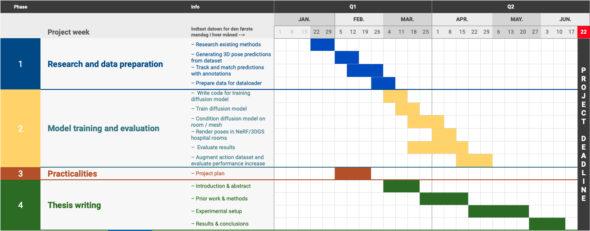

# Masters thesis - Project plan

## Project title

3D human interaction synthesis for action recognition data augmentation

## Author

Anders Bredgaard Thuesen (andersbthuesen[that weird "a" here]gmail.com)

## Project period

January 29th - June 29th (~5 Months)

## Supervisors

DTU: Morten Rieger Hannemose (mohan[that weird "a" here]dtu.dk)

Teton.ai: Frederik Warburg (frederik[that weird "a" here]teton.ai)

## Introduction

Care homes and hospitals are currently grappling with significant challenges in providing high-quality care due to a persistent shortage of healthcare professionals. This shortage, fueled by an aging population's increasing demand for healthcare services and a declining number of new entrants into the healthcare profession, is straining these institutions. Furthermore, as the demand for documentation in healthcare is growing, professionals have less time for patient interaction limiting face-to-face engagement and the ability to address patients' needs effectively.

Addressing this critical issue requires innovative solutions and a concerted effort to improve working conditions and attract more individuals to the healthcare profession.

Teton.ai is enhancing the capabilities of healthcare professionals by equipping them with advanced tools for improved patient monitoring. The company achieves this by installing intelligent camera sensors in the hospital rooms. These sensors feature on-device processing, enabling the system to alert staff about patient falls promptly, all while ensuring patient privacy is not compromised.

It is an open question whether it is possible to automate some of the documentation burden using deep learning and computer vision, requiring vast amounts of training data which is often inaccessible and expensive to label. One posed solution is to first construct a simulator of the environment enabling the sampling of synthetic data, ideally capturing the ditribution of real-life hospital and care home scenarios.

In recent years generative models like Variational Auto Encoders (VAEs), Generative Adverserial Networks (GANs) and Denoising Diffusion Models (DDMs) have shown incredible results in generating highly realistic images and videos from text. One might ask the question whether these models could enable the learning of this kind of simulator. However, due to the high dimensionality of images and videos, large amounts of data is required to train such models, defeating its own purpose. Instead, representing the humans in the scene explicitly using e.g. the SMPL model combined with realistic computer rendering could provide a feasible alternative.

## Project description

The goal of this project is investigate generative methods for synthesizing realistic 3D human movements and interactions in order to augment the data used to improve the performance of action recognition models in a hospital or care home environment.

## Project plan

### Overview

1. Train a diffusion model from 3D human pose sequences of healthcare workers and patients to conditionally synthesize new scenarios constrained by the room geometry.
2. Render scenes of the generated pose sequences in a 3D reconstruction (NeRFs / 3DGs) of varying hospital rooms.
3. Examine the effect on performance of introducing synthetic data in training action recognition models.

## References

https://khanhha.github.io/posts/SMPL-model-introduction/
http://files.is.tue.mpg.de/black/papers/SMPL2015.pdf
https://openaccess.thecvf.com/content_CVPR_2019/papers/Zhou_On_the_Continuity_of_Rotation_Representations_in_Neural_Networks_CVPR_2019_paper.pdf
